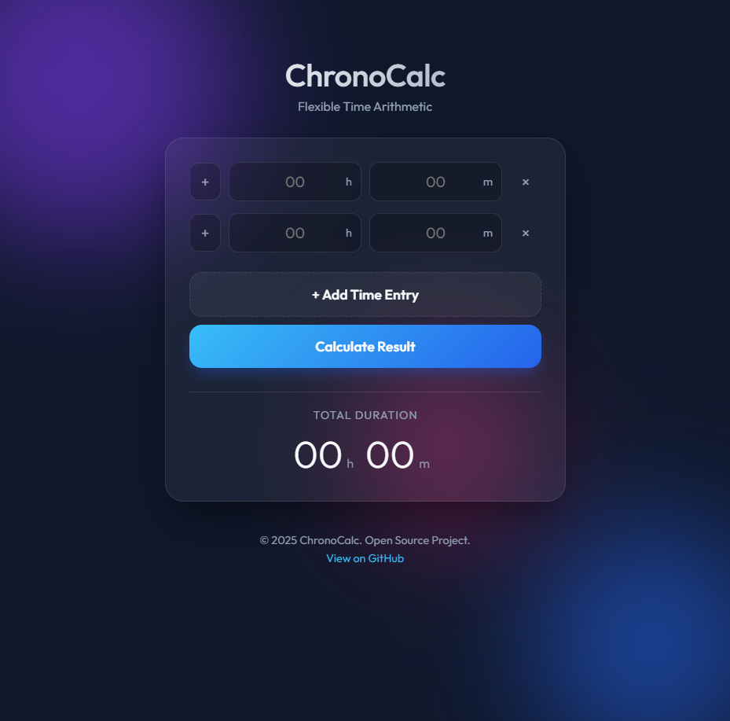
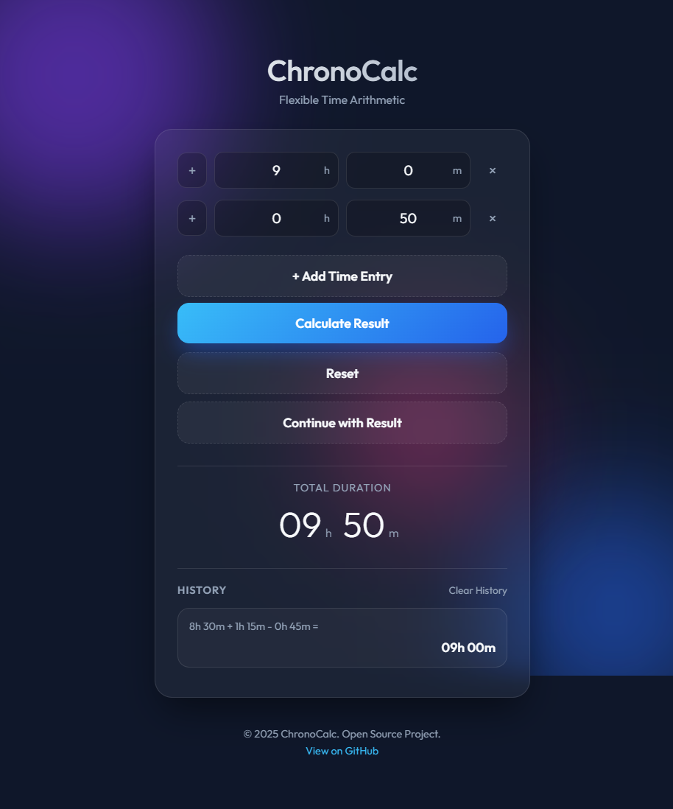
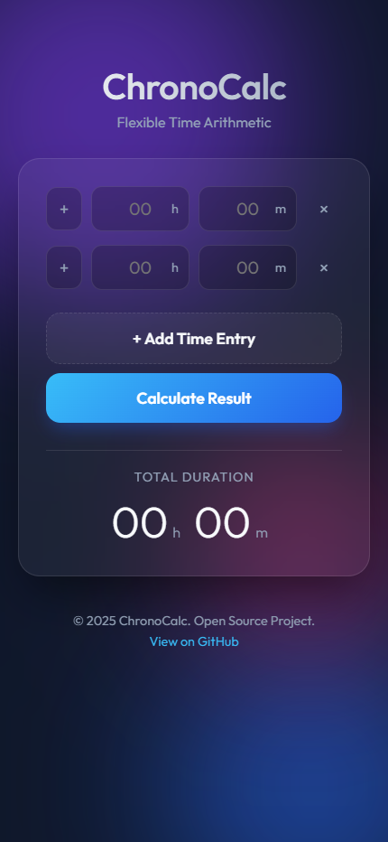

# ChronoCalc

<p align="center">
  <strong>Premium time arithmetic in the browser.</strong><br />
  A polished, zero-dependency web app for adding, subtracting, chaining, and revisiting time calculations.
</p>

<p align="center">
  <a href="https://time.bojiang.org/">Live Demo</a>
  ·
  <a href="https://github.com/hakupao/time_calculator_web_app">Repository</a>
</p>

<p align="center">
  
  
  
  
</p>

<p align="center">
  
</p>

## Overview

ChronoCalc is a focused utility for people who need quick, reliable time arithmetic without opening spreadsheets or mental-math gymnastics. It supports multi-row addition and subtraction, result chaining, and local history, wrapped in a clean interface that feels more like a small product than a throwaway tool.

This repository is also a strong portfolio piece: it shows product thinking, UI craft, front-end fundamentals, and the ability to ship a complete experience as a lightweight static app.

## Why It Stands Out

- Solves a real, everyday problem for work logs, editing timelines, scheduling, and duration planning.
- Ships as a static site with no framework or build pipeline, which keeps deployment simple and performance predictable.
- Uses a polished visual language with glassmorphism, animated background gradients, and clear information hierarchy.
- Keeps useful state locally with calculation history stored in the browser.
- Supports chaining results into the next calculation, which makes repeated workflows much faster.

## Feature Highlights

- Add and subtract multiple hour/minute rows in a single calculation.
- Dynamically add or remove rows as the expression grows.
- Continue from the previous result instead of starting over.
- Preserve history in `localStorage` for quick recall.
- Work smoothly across desktop and mobile screen sizes.
- Run anywhere a static site can be hosted.

## Screenshots

<p align="center">
  
</p>

<p align="center">
  
</p>

## Use Cases

- Track work hours across multiple tasks or shifts.
- Add and subtract video or audio editing durations.
- Calculate travel, meeting, or production timelines.
- Quickly sanity-check schedule math without opening a spreadsheet.

## Tech Stack

- `HTML5` for semantic structure and clean deployment.
- `CSS3` for layout, animation, glassmorphism, and responsive behavior.
- `Vanilla JavaScript` for time arithmetic, dynamic rows, UI state, and history persistence.
- `Google Fonts` using the `Outfit` typeface for a sharper visual identity.

## Project Structure

```text
.
├── index.html     # Semantic page structure and metadata
├── style.css      # Visual design, motion, layout, responsive rules
├── script.js      # Time calculation logic, row management, history state
└── assets/
    └── screenshots/
```

## Run Locally

This is a static front-end project, so local setup is intentionally minimal.

```bash
git clone https://github.com/hakupao/time_calculator_web_app.git
cd time_calculator_web_app
```

Then use either of these options:

```bash
# Option 1: open directly
start index.html

# Option 2: serve locally
python -m http.server 8000
```

If you use the local server option, open [http://localhost:8000](http://localhost:8000).

## Deployment

The live version is available at [time.bojiang.org](https://time.bojiang.org/).

Because the app is fully static, it can also be deployed to platforms such as:

- GitHub Pages
- Cloudflare Pages
- Netlify
- Vercel
- Nginx or any traditional web server
- Synology Web Station

## Portfolio Value

If you are evaluating this project as a sample of front-end work, it demonstrates:

- The ability to turn a small utility into a polished product experience.
- Good judgment about when a framework is unnecessary.
- Attention to interaction details such as row animation, visual feedback, and persistent state.
- A deployable, user-facing result rather than just an isolated code exercise.

## Builder Note

Built and deployed by [Bojiang Zhang](https://github.com/hakupao).

If you like practical, well-finished web products that prioritize clarity, speed, and usability, this project is a representative example of that approach.
